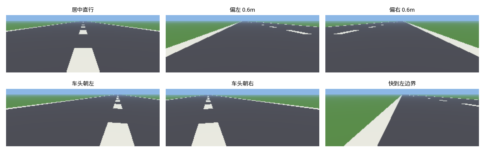
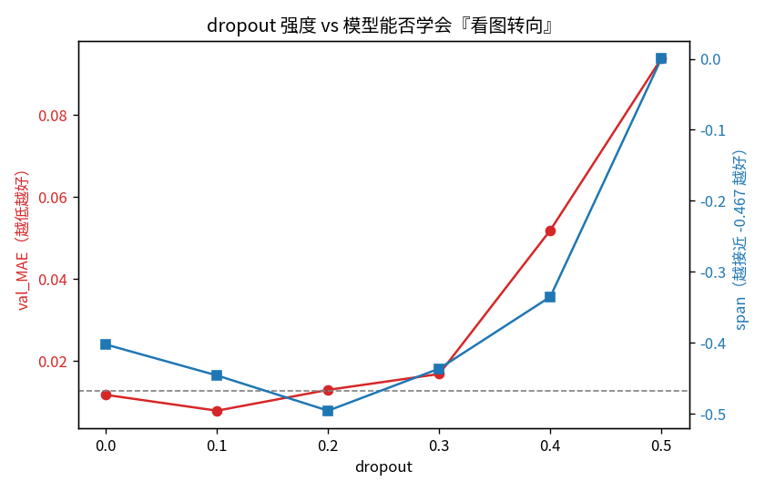
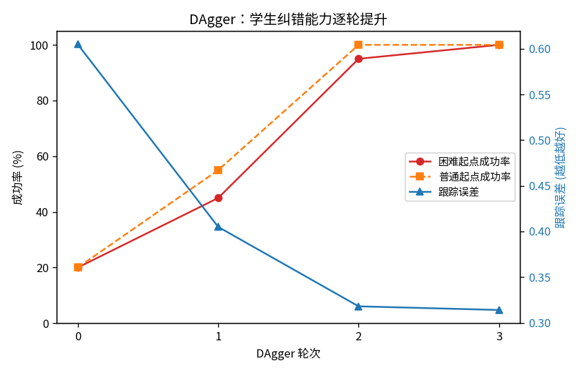
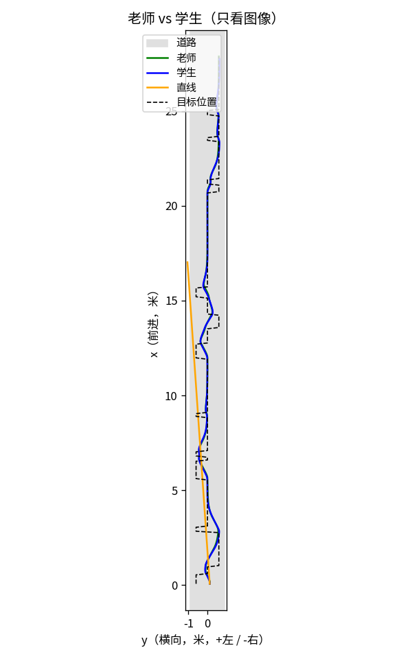

# OpenBot 仿真环境 —— 从零构建笔记

> 这不是一份"复制粘贴跑通"的文档，而是一份**从零搭出一个能替代真实 OpenBot 的仿真环境**、并**亲手定位一个真实训练 bug** 的完整记录。
>
> 目标：把智能手机机器人 OpenBot 的"大脑"训练流程，搬到仿真里跑通——
> **仿真 → 老师出题 → 导出数据 → 训练 CNN → 生成 `.tflite` → 回灌仿真开车。**

---

## 目录

1. [快速开始](#1-快速开始)
2. [总蓝图](#2-总蓝图)
3. [接口契约（最重要）](#3-接口契约最重要)
4. [七个模块逐个讲](#4-七个模块逐个讲)
5. [老师策略](#5-老师策略)
6. [数据工厂：export_data 与 dagger](#6-数据工厂export_data-与-dagger)
7. [GPU 训练环境](#7-gpu-训练环境)
8. [调查实录：模型为什么"不看图像"](#8-调查实录模型为什么不看图像)
9. [DAgger 实验：20% → 100%](#9-dagger-实验20--100)
10. [文件索引](#10-文件索引)
11. [命令速查](#11-命令速查)
12. [经验教训](#12-经验教训)

---

## 1. 快速开始

### 依赖

- **CPU 环境** `openbot`：conda 环境，Python 3.9 + TensorFlow 2.9.3
- **GPU 环境** `openbot-gpu`：conda 环境，Python 3.10 + TensorFlow 2.15.1 + CUDA 12.2（见 [第 7 节](#7-gpu-训练环境)）
- 纯几何/渲染模块只需要 `numpy` / `matplotlib` / `Pillow`

### 一分钟体验

```bash
cd OpenBot/sim

# M0 状态与动力学
python3 state.py
python3 dynamics.py

# M1 世界地图
python3 world.py
python3 m1_demo.py

# M2 相机（会生成 m2_views.png）
python3 m2_demo.py

# M3 闭环（随机策略 vs 直线策略）
python3 m3_demo.py

# M4 老师策略
python3 m4_demo.py
```

### 训练一个会开车的模型

```bash
cd OpenBot/sim

# 1) 用老师生成数据
python3 export_data.py --out ../policy/ds_dagger --train-episodes 4 --test-episodes 1 --steps 400

# 2) 训练（GPU）
./gpu_python.sh train_plain.py --data ../policy/ds_dagger/train_data \
    --arch cil --dropout 0.1 --epochs 15 --batch 32 --out ../policy/models/student.tflite

# 3) 装回仿真看他开车
./gpu_python.sh m5_demo.py --model ../policy/models/student.tflite

# 4) 严格评估（困难起点 + 扰动）
./gpu_python.sh eval_student.py --model ../policy/models/student.tflite --episodes 20 --disturb 0.02
```

---

## 2. 总蓝图

### 设计原则

1. **接口优先**：先把"观测/动作"的规格钉死，再填内容。
2. **分层解耦**：物理、视觉、任务互相独立，每层都能单独测试。
3. **小步可验证**：先做没有画面的纯数学，跑通了再加相机、再加策略。

### 分层架构

```
                          ┌─────────────────────────────┐
                          │        策略 Policy           │
                          │  随机 / 规则老师 / tflite学生 │
                          └──────────────┬──────────────┘
                                         │ 动作 [left, right] ∈ [-1,1]
                                         ▼
┌───────────────────────────────────────────────────────────────────┐
│                        仿真环境 Env                                 │
│   ┌──────────┐        ┌────────────┐        ┌────────────┐         │
│   │ 动力学    │◄───────│  动作接口   │        │   世界地图  │         │
│   │ Vehicle  │        │ (夹到[-1,1])│        │   World    │         │
│   └────┬─────┘        └────────────┘        └──────┬─────┘         │
│        │ pose                                      │               │
│        ▼                                           │               │
│   ┌──────────┐        pose + 地图                    │               │
│   │  相机     │◄───────────────────────────────────┘               │
│   │ Camera   │                                                     │
│   └────┬─────┘                                                     │
│        │ 图像 (96,256,3) in [0,1]                                  │
│        ▼                                                           │
│   ┌──────────┐  {image, cmd}      ┌────────────┐                   │
│   │ 观测组装  │──────────────────►│  任务/奖励  │                   │
│   │ Obs      │                   │   Task     │                   │
│   └──────────┘                   └─────┬──────┘                   │
│                                        │ reward, done              │
│   ┌────────────────────────────────────▼───────────────────────┐   │
│   │            闭环 Loop:  reset() / step()  (Gym 风格)          │   │
│   └────────────────────────────────────────────────────────────┘   │
└───────────────────────────────────────────────────────────────────┘
                         │                        │
                         ▼                        ▼
                ┌────────────────┐      ┌────────────────┐
                │ 沙盒：跑策略     │      │ 数据工厂：导出   │
                │ (m5_demo/eval) │      │ OpenBot 训练格式 │
                └────────────────┘      └────────────────┘
```

### 依赖关系（单向、无环）

```
state ◄─ dynamics ◄─┬─ env ─► observation
                    │    ├─► camera ─► world
                    │    └─► task ───► world
                    └─ spaces
```

---

## 3. 接口契约（最重要）

仿真要能替代真实机器人，它对策略**露出**的东西必须和真实 OpenBot **一模一样**。以下每条都从 OpenBot 源码里核实过。

| 接口 | 规格 | 主要出处 |
|------|------|---------|
| **动作** | `[left, right]`，每个 ∈ `[-1, 1]` | `android/.../vehicle/Control.java:8-9` |
| **动作→串口** | `c<int(left*255)>,<int(right*255)>` | `python/infer.py:70` |
| **图像观测** | `(高=96, 宽=256, 3)`，float `[0,1]` | `android/.../tflite/Autopilot.java:36-52`，`assets/config.json` |
| **指令观测 cmd** | 标量 `-1 / 0 / +1`（左/直/右）| `Autopilot.java:69`，`utils/Enums.java:163` |
| **模型输入** | `(img_input, cmd_input)` | `policy/openbot/models.py:153` |
| **模型输出** | 2 个数 `[left, right]` | `policy/openbot/models.py:149` |
| **训练标签** | `left/255, right/255` | `policy/openbot/dataloader.py:19` |

> **注意 `cmd` 的语义**：它不是"速度"，而是**转向指示灯指令**（`Vehicle.setIndicator`），取值 `{-1,0,1}`。本项目把它解释为"目标横向位置"。

---

## 4. 七个模块逐个讲

| # | 文件 | 职责 | 依赖 |
|---|------|------|------|
| 1 | `state.py` | 状态 `(x, y, theta)`，纯数据 + 角度归一化 | 无 |
| 2 | `dynamics.py` | 差速运动学：`[left,right]` → 状态变化 | state |
| 3 | `world.py` | 道路几何：横向偏移、在不在路上 | 无 |
| 4 | `camera.py` | 前视针孔相机 + 地平面射线求交渲染 | numpy，用 world 查几何 |
| 5 | `task.py` | 奖励 + 终止条件 | world |
| 6 | `observation.py` | 按契约打包 `{image, cmd}` | numpy |
| 7 | `env.py` | 闭环 `reset()` / `step()` | 以上全部 + spaces |

### 1) `state.py`

```python
State(x, y, theta)      # +x 车头方向，+y 左侧，+theta 逆时针
.reset() / .pose() / .copy()
wrap_angle()            # theta 永远落在 (-pi, pi]
```

### 2) `dynamics.py`

差速驱动就两行数学：

```
v     = (v_l + v_r) / 2
omega = (v_r - v_l) / WHEEL_BASE
```

参数对齐真实 OpenBot：`WHEEL_BASE=0.14`、`MAX_WHEEL_SPEED=1.2`、`DT=0.1`（10 Hz）。

**方向约定**：左轮快 → 右转（theta 减小）。

### 3) `world.py`

一条沿 +x 的直道，中心线 `y=0`。关键设计：

```python
def centerline_y(self, x):
    return 0.0        # 驻成函数，将来换弯道只改这一处
```

### 4) `camera.py`

前视针孔相机 + 地平面求交：

```
每个像素 → 一条射线 → 打到地面 z=0 → 落点 (Px, Py)
                                          ↓
             用 world.lateral_offset 判断在路上/路外 → 上色
```

**几何在 world，外观在 camera**——世界换成弯道，相机代码不用改。

渲染效果（`python3 m2_demo.py` 生成）：



### 5) `task.py`

指令条件下的车道保持。奖励 = 目标横向 + 车头朝前 + 前进 - 动作抖动；冲出道路/掉头则终止并重罚。

### 6) `observation.py`

极薄的一层，只做形状/类型对齐：

```python
def make_observation(image, cmd):
    return {"image": np.asarray(image, np.float32), "cmd": np.array([float(cmd)], np.float32)}
```

### 7) `env.py`

```python
obs, info = env.reset(seed=...)                                    # Gym 风格
obs, reward, terminated, truncated, info = env.step(action)        # 5 元组
```

`reset()` 与 `step()` 共用 `_info()`，保证第一步也能读到完整状态（这是写老师时踩过的坑）。

---

## 5. 老师策略

`policies.py` 里的 `TeacherPolicy` 用**上帝视角**做串级比例控制：

```
① 横向误差 e = 目标横向 - 当前横向
        ↓ × k_lat
② 期望航向 theta_des（限幅）
        ↓ × k_head
③ 角速度 omega
        ↓ 反解
④ 左右轮指令 [v_l, v_r]
```

它读的是 `info` 里的**特权信息**（`lateral` / `heading` / `target_lateral`）——**这正是学生看不到、老师可以"作弊"的部分**。

> 老师用上帝视角**出题**，学生只看图像**作答**。这是行为克隆的核心分工。

---

## 6. 数据工厂：export_data 与 dagger

### `export_data.py` —— 老师开车，导出 OpenBot 格式

严格对齐 `policy/openbot/associate_frames.py` 期望的结构：

```
dataset/
  train_data/sim/session_000/
    images/<timestamp>_crop.jpeg
    sensor_data/
      rgbFrames.txt      # <ts> <frame_id>
      ctrlLog.txt        # <ts> <left> <right>    整数 [-255,255]
      indicatorLog.txt   # <ts> <cmd>
      matched_frame_ctrl_cmd_processed.txt
```

关键技巧：时间戳间隔取 `1e8`，远大于匹配阈值 `1e3`，保证**一帧精确匹配一条控制/指令**。

### `dagger.py` —— DAgger 数据集聚合

```
1. 学生自己开（以概率 beta 用老师动作兜底，避免一上来就翻车）
2. 在每个经过的状态，记录【老师会怎么做】
3. 追加进数据集
4. 重训 → 学生学会"犯错后怎么补救"
```

支持 `--disturb` 注入扰动，逼出"偏离→纠错"的样本。

---

## 7. GPU 训练环境

### 为什么这么麻烦

| 坑 | 说明 |
|----|------|
| 驱动版本不匹配 | 内核模块 580.159 vs 用户态库 580.178 → **重启**解决 |
| TF 版本与算力 | OpenBot 原配 **TF 2.9.3 + CUDA 11.2 不支持 RTX 4060（Ada, sm_89）**；CUDA 11.8 才支持 Ada |
| CUDA 版本误判 | **TF 2.15 需要 CUDA 12.2**（不是 11.8；11.8 是 2.13/2.14）|
| libdevice 缺失 | batch norm 的 JIT 需要 `libdevice.10.bc`，来自 `nvidia-cuda-nvcc-cu12` |
| 内存 OOM | `--no_tf_record` 会 `.cache()` 整个数据集 + `100×batch` shuffle buffer |

### 配置步骤

```bash
# 1) 新环境
conda create -n openbot-gpu python=3.10 -y
conda run -n openbot-gpu pip install "tensorflow==2.15.1" pydot ipython nbconvert matplotlib pillow "numpy<2"

# 2) CUDA 12.2 运行库（pip）
conda run -n openbot-gpu pip install \
  "nvidia-cublas-cu12==12.2.5.6" "nvidia-cuda-nvrtc-cu12==12.2.140" \
  "nvidia-cuda-runtime-cu12==12.2.140" "nvidia-cudnn-cu12==8.9.2.26" \
  "nvidia-cufft-cu12==11.0.2.54" "nvidia-curand-cu12==10.3.3.141" \
  "nvidia-cusolver-cu12==11.5.2.141" "nvidia-cusparse-cu12==12.1.0.106" \
  "nvidia-nccl-cu12==2.16.5" "nvidia-nvjitlink-cu12==12.2.140" \
  "nvidia-nvtx-cu12==12.2.140" "nvidia-cuda-nvcc-cu12==12.2.140"
```

### `gpu_python.sh`

```bash
#!/usr/bin/env bash
set -e
PREFIX=/home/luc/miniconda3/envs/openbot-gpu
NVIDIA_LIBS=$(ls -d "$PREFIX"/lib/python3.10/site-packages/nvidia/*/lib 2>/dev/null | tr '\n' ':')
export LD_LIBRARY_PATH="${NVIDIA_LIBS}${PREFIX}/lib${LD_LIBRARY_PATH:+:$LD_LIBRARY_PATH}"
export TF_CPP_MIN_LOG_LEVEL="${TF_CPP_MIN_LOG_LEVEL:-2}"
export XLA_FLAGS="--xla_gpu_cuda_data_dir=${PREFIX}/lib/python3.10/site-packages/nvidia/cuda_nvcc ${XLA_FLAGS}"
exec "$PREFIX/bin/python" "$@"
```

### 内存优化：为什么用 tfrecord

| 管线 | 是否 `.cache()` 全量数据 | shuffle buffer | batch=64 时约 |
|------|------------------------|---------------|--------------|
| `--no_tf_record`（目录）| ✅ 是（约 2.7GB）| `100 × batch` = 6400 张 | **≈ 4.6GB** |
| **tfrecord（默认）** | ❌ 否 | `10 × batch` = 640 张 | **≈ 0.2GB** |

再配合 `systemd-run -p MemoryMax=10G` 限制训练进程内存，避免拖垮桌面。

### 效果

```
CPU：~30 秒/epoch        GPU：6~8 秒/epoch（约 4~5 倍）
内存峰值：8.4GB（OOM）→ 1.9GB（安全）
```

---

## 8. 调查实录：模型为什么"不看图像"

这是整个项目里**最有价值**的一段。现象：训练出的策略在仿真里只开 46 步就翻车，横向扫描证明它**完全无视图像**。

### 完整的排除法证据链

| # | 实验 | 结果 | 排除了什么 |
|---|------|------|-----------|
| 1 | DAgger 2 轮 + 扰动 | ❌ 仍 46 步翻车 | 数据覆盖不足 |
| 2 | 换普通 MSE 损失 | ❌ 仍忽略图像 | 损失函数 |
| 3 | cmd 固定为 0（断捷径）| ❌ 仍忽略图像 | cmd 捷径 |
| 4 | **内存内数据**（无 JPEG/路径）| ❌ 仍忽略图像 | **数据错位** |
| 5 | 探针：图像→横向偏移 | ✅ **MAE 0.024** | **相机无信息 / CNN 提取不了** |
| 6 | 标签去中心化（只学转向）| ❌ 仍忽略图像 | 损失被常量主导 |
| 7 | **换简单架构** | ✅ **立刻学会** | **元凶 = `cil_mobile` 架构** |

### 消融实验：锁定到 dropout

```
变体                       train_MAE     span    转向序列(左→右)
cil（原始）                 0.0956   -0.025   [0.009, -0.011, 0.006, -0.010, -0.016]  ❌
cil_nodropout              0.0193   -0.478   [0.245,  0.224,  0.012, -0.222, -0.233]  ✅
cil_nobn                   0.0944   +0.000   [-0.000, ...]                             ❌
cil_nocmdconcat            0.0965   -0.000   [0.003,  0.003,  0.003,  0.003,  0.003]  ❌
cil_nodropout_nobn         0.0037   -0.513   ✅ 最好
simple                     0.0086   -0.425   ✅
老师                        —      -0.467
```

**只关 dropout 就能复活。** batch norm 和 cmd 拼接都不是主因。

### dropout 扫描：一条悬崖曲线

```
dropout:  0.0    0.1    0.2    0.3    0.4    0.5
val_MAE: 0.012  0.008  0.013  0.017  0.052  0.094
span:   -0.40  -0.45  -0.50  -0.44  -0.34   0.00
```

**0~0.3 都能学，0.4 开始退化，0.5 断崖式崩溃。**



### 根因与机理

```
cil_mobile 的 dropout = 0.5（官方默认值）
        ↓
训练时随机抹掉一半神经元
        ↓
我们的任务信号很弱：前进分量 ~0.6，转向分量仅 ±0.2
        ↓
网络发现"输出条件均值"比"学那个被噪声淹没的细微转向"更省损失
        ↓
退化成捷径策略：只看 cmd，不看图像
        ↓
仿真中只会直行 → 翻车
```

### 端到端验证

| 模型 | 步数 | 跟踪误差 | 结果 |
|------|------|---------|------|
| 老师 | 400 | 0.197 | timeout |
| `cil_d01`（dropout 0.1）| 400 | 0.209 | ✅ 追平老师 |
| `cil_d50`（dropout 0.5）| 89 | 0.611 | ❌ 翻车 |
| `simple_bc`（无 dropout）| 400 | 0.200 | ✅ 追平老师 |

---

## 9. DAgger 实验：20% → 100%

学生修好后，DAgger 才真正有意义。设计：

```
初始数据：仅老师数据 1600 帧
每轮：学生开（beta=0.3）+ 10% 扰动 → 老师标注 → 追加 → 重训
评估：20 局【困难起点】（偏边、大角度）+ 2% 扰动
```

| 轮次 | 数据量 | 困难起点成功率 | 跟踪误差 | 普通起点成功率 |
|------|--------|--------------|---------|--------------|
| 0（基线）| 1600 | **20%** | 0.605 | 20% |
| 1 | 4000 | **45%** | 0.405 | 55% |
| 2 | 6165 | **95%** | 0.318 | 100% |
| 3 | 8565 | **100%** | 0.314 | 100% |

图见：



**为什么这次成功、上次失败？**

| | 上次（失败）| 这次（成功）|
|---|---|---|
| 学生状态 | 架构 bug，**根本不会开** | 已修复，**开得很好** |
| 探索到的状态 | 乱撞、打转（无意义）| 合理的"偏离→纠错"状态 |
| 结果 | ❌ 毫无改善 | ✅ 20% → 100% |

> **DAgger 的前提：学生得"会开一点"，才能探索出有意义的失败状态让老师纠正。**

---

## 10. 文件索引

### 仿真核心

| 文件 | 说明 |
|------|------|
| `state.py` | 模块1 状态 |
| `dynamics.py` | 模块2 差速动力学 |
| `world.py` | 模块3 道路几何 |
| `camera.py` | 模块4 相机渲染 |
| `task.py` | 模块5 任务/奖励 |
| `observation.py` | 模块6 观测组装 |
| `env.py` | 模块7 闭环 |
| `spaces.py` | 观测/动作空间定义 |
| `policies.py` | 随机 / 老师 / TFLite 策略 |

### 演示脚本

| 文件 | 输出 |
|------|------|
| `m1_demo.py` | 状态+动力学+世界 组合演示 |
| `m2_demo.py` | 相机视角拼图 → `m2_views.png` |
| `m3_demo.py` | 随机 vs 直线 闭环 → `m3_trajectory.png` |
| `m4_demo.py` | 加入老师 → `m4_trajectory.png` |
| `m5_demo.py` | 老师 vs 学生 vs 直线 → `m5_trajectory.png` |
| `eval_student.py` | 多局困难起点鲁棒性评估 |

学生开车效果（`m5_demo.py` 生成）：



### 数据与训练

| 文件 | 说明 |
|------|------|
| `export_data.py` | 老师数据导出 |
| `dagger.py` | DAgger 采集 |
| `train_plain.py` | 可配置架构/损失/正则的最小训练器 |
| `gpu_python.sh` | GPU 运行封装 |

### 教学/诊断脚本

| 文件 | 说明 | 产物 |
|------|------|------|
| `tiny_nn.py` | 纯 numpy 手写迷你神经网络（行为克隆）| — |
| `tiny_cnn.py` | 纯 numpy 卷积演示 | `tiny_cnn.png` |
| `probe_inmem.py` | 内存内数据实验 | — |
| `probe_lateral.py` | 图像→横向偏移探针 | — |
| `probe_ablation.py` | 架构消融 | — |
| `probe_dropout.py` | dropout 扫描 | `dropout_sweep.png` |

### 模型产物（`policy/models/`）

| 文件 | 说明 |
|------|------|
| `simple_bc.tflite` | 简单架构行为克隆，✅ 能开车 |
| `cil_d01.tflite` | 官方架构 dropout=0.1，✅ 能开车 |
| `cil_d50.tflite` | 官方架构 dropout=0.5，❌ 翻车（对照组）|
| `dg_s0~s3.tflite` | DAgger 各代学生（20% → 100%）|
| `dagger_round0/1/2.tflite`、`plain_mse`、`plain_zero`、`gpu_round` | 调查过程留档 |

---

## 11. 命令速查

```bash
# ---------- 仿真演示（无需 TF）----------
cd OpenBot/sim
python3 state.py && python3 dynamics.py && python3 world.py
python3 m1_demo.py && python3 m2_demo.py && python3 m3_demo.py && python3 m4_demo.py

# CPU 环境跑 m5
conda run -n openbot python m5_demo.py --model ../policy/models/cil_d01.tflite

# ---------- 数据 ----------
python3 export_data.py --out ../policy/ds_dagger --train-episodes 4 --test-episodes 1 --steps 400
./gpu_python.sh dagger.py --model ../policy/models/dg_s0.tflite --beta 0.3 --disturb 0.1 \
    --episodes 6 --tag r1 --out ../policy/ds_dagger

# ---------- 训练 ----------
./gpu_python.sh train_plain.py --data ../policy/ds_dagger/train_data \
    --arch cil --dropout 0.1 --epochs 15 --batch 32 --out ../policy/models/student.tflite

# 用 OpenBot 官方管线训练（需先建 tfrecord）
cd ../policy
../sim/gpu_python.sh -m openbot.train --create_tf_record --model cil_mobile \
    --batch_size 64 --num_epochs 30 --learning_rate 0.002 --batch_norm --flip_aug

# ---------- 评估 ----------
cd ../sim
./gpu_python.sh eval_student.py --model ../policy/models/dg_s3.tflite --episodes 20 --disturb 0.02

# ---------- 诊断实验 ----------
./gpu_python.sh probe_inmem.py --n 4000 --epochs 20 --zero-cmd
./gpu_python.sh probe_lateral.py --n 4000 --epochs 20
./gpu_python.sh probe_ablation.py --n 4000 --epochs 20 --zero-cmd
./gpu_python.sh probe_dropout.py
```

---

## 12. 经验教训

1. **接口优先**：先把"真车能给什么观测、接受什么动作"钉死，仿真才有意义。观测必须是**真车也能拿到的交集**（所以真车没有精确坐标，仿真里也绝不能喂）。

2. **分层解耦让调试变简单**：动力学不需要画面就能测；相机可以固定位姿单测；任务可以脱离相机验证。每层单独可测，出错时能快速定位。

3. **验证指标会骗人**：`val_angle_metric=0.985` 看着完美，其实被 98% 的简单样本稀释了。**必须单独看"难样本"的表现。**

4. **行为克隆的致命伤是分布漂移**：学生一旦犯错就到"老师没示范过"的状态，越错越远。DAgger 是标准解法。

5. **DAgger 的前提是学生得"会一点"**：一个完全不会开的学生，采集到的只是垃圾数据，DAgger 毫无用处。

6. **正则化不是越多越好，尤其对回归任务**：dropout=0.5 是分类任务的常用值，但会让"信号弱、数据少"的精细回归任务退化成"输出均值"的捷径策略。**正则化太强 = 变相惩罚"认真学习"。**

7. **"捷径学习"不只来自架构连接，也来自正则化**：我们一开始以为是 cmd 拼接导致捷径，消融实验才发现真凶是 dropout。

8. **科学方法就是排除法**：先确认"图像有信息"（探针），再确认"数据对齐"（内存实验），再逐个关部件（消融）——每一步排除一个假设，最后锁定元凶。**不要凭直觉猜，要让实验说话。**

9. **小数据 + 强模型 ≠ 好结果**：官方在几十万帧真实数据上能用的架构，在 ~9000 帧合成数据上就失效了。**架构的好坏取决于数据尺度。**

---

## 附：一句话总结

> **我们用一个接口与真实 OpenBot 完全一致的仿真环境，跑了老师出题 → 数据导出 → CNN 训练 → tflite 回灌的完整闭环；并在过程中用一套系统的排除法，定位出"模型忽略图像"的根因是默认架构的 dropout=0.5 造成的捷径学习；最后用 DAgger 把学生的纠错成功率从 20% 提升到 100%。**
